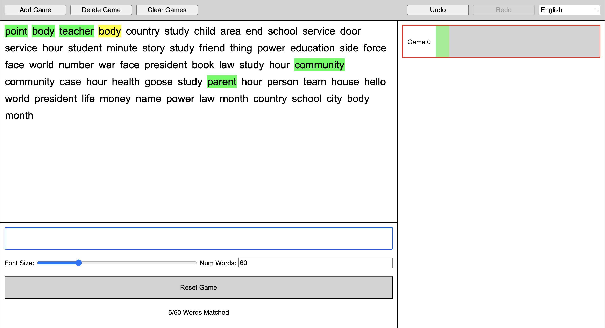

# DonkeyType


# DonkeyType: A MonkeyType-Inspired Typing Game


DonkeyType is a dynamic and customizable typing game inspired by MonkeyType. It combines the competitive thrill of racing against others with a sleek, user-friendly design. Perfect for improving typing speed, accuracy!

## Features

### ✨ Customization
- **Font Size**: Adjust the font size for optimal readability and comfort.
- **Font Style**: Choose from a variety of fonts to personalize your typing experience.
- **Concurrent Games**: Multiple games can run simultaneously without interference
- **Language Options**: Switch between French and English




### Prerequisites
- Node.js (v14+)
- npm

### Clone the Repository
```bash
git clone https://github.com/jennymyzhang/donkeytype.git
cd game
npm run dev
